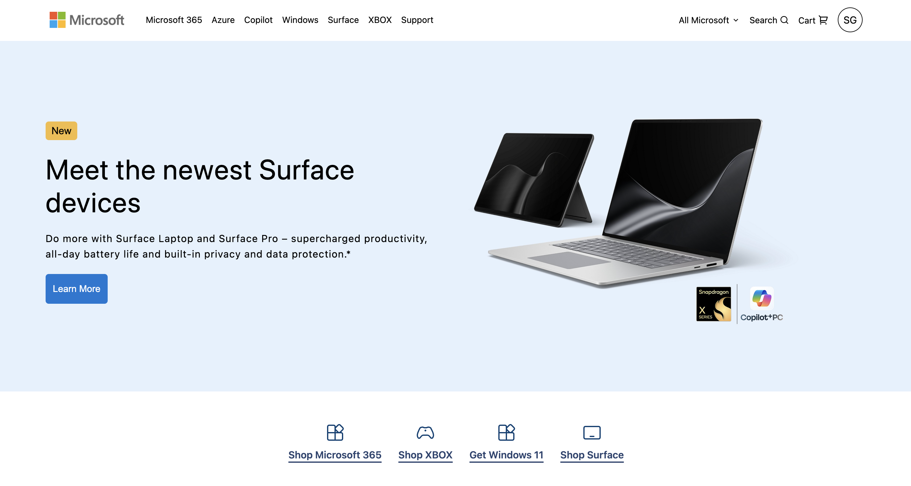

# Microsoft Clone

A responsive **Microsoft website clone** built from scratch using **HTML5 and CSS3**. This project recreates the visual layout, navigation, hero section, cards, and overall styling of the Microsoft website while focusing on clean and responsive frontend design.

## 📸 Project Preview



## 🚀 Features

- Responsive website layout
- Microsoft-inspired navigation bar
- Hero/banner section
- Product and service cards
- Clean and modern UI
- Hover effects and CSS transitions
- Responsive design for different screen sizes
- Structured and reusable HTML/CSS

## 🛠️ Technologies Used

- **HTML5** – Website structure and content
- **CSS3** – Styling, layout, animations, and responsiveness

## 📂 Project Structure

```text
microsoft-clone/
│
├── index.html
├── style.css
├── microsoft.png
└── README.md
```

## 🎯 Purpose

This project was created to practice and improve my **HTML and CSS frontend development skills**, including responsive layouts, Flexbox, CSS positioning, spacing, typography, shadows, hover effects, and modern UI design.

## 👨‍💻 Author

**Saransh Gupta**

- GitHub: [saranshgupta-dev](https://github.com/saranshgupta-dev)
- LinkedIn: [Saransh Gupta](https://www.linkedin.com/in/saransh-gupta-dev/)

## ⚠️ Disclaimer

This project is created for **educational and practice purposes only**. Microsoft and its related trademarks, logos, and brand assets belong to Microsoft.
